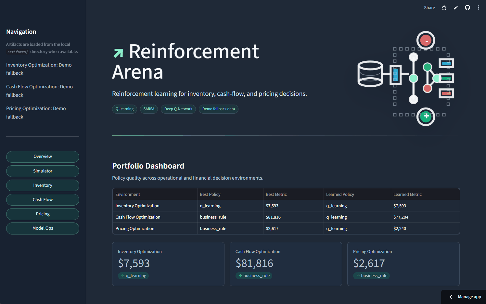
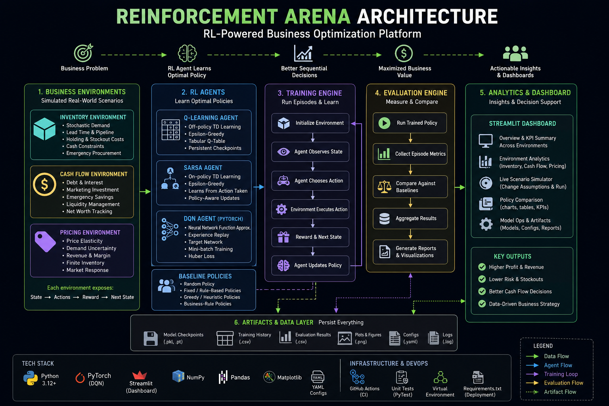
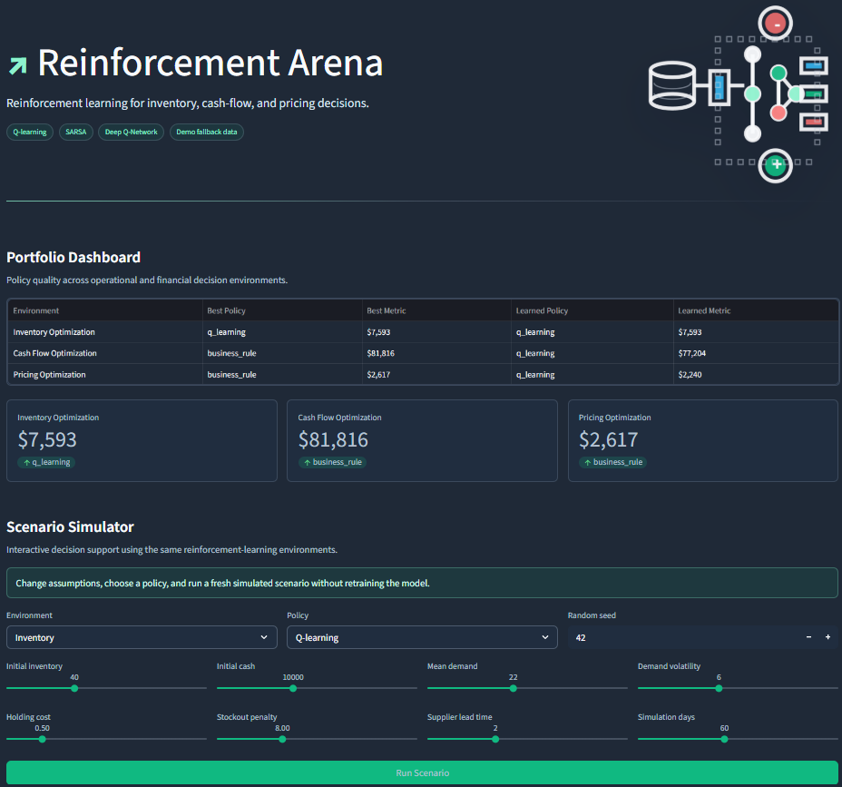

<div align="center">

# 🦾 Reinforcement Arena 🔁

### Self-Learning AI Agents for Inventory, Cash Flow, Pricing, and Business Operations Optimization

<p align="center">
  
  
  
  
  
  
  
  
  
  
  
</p>

<p align="center">
  
</p>

</div>

---

# 🚀 Executive Summary

Reinforcement Arena is a production-style reinforcement learning platform for sequential business decision optimization.

The system trains AI agents to make intelligent operational and financial decisions across simulated business environments including:

- Inventory management
- Cash-flow allocation
- Dynamic pricing optimization

The platform implements multiple reinforcement learning algorithms including:

- Q-Learning
- SARSA
- Deep Q-Networks (DQN)

while benchmarking learned policies against realistic business-rule baselines.

Originally inspired by the reinforcement learning concepts introduced in Harvard's CS50AI Nim project, Reinforcement Arena evolves those ideas into a scalable business intelligence and AI experimentation platform designed for operations research, financial optimization, and decision intelligence workflows.

---

# 🧠 Core Idea

Traditional machine learning predicts outcomes.

Reinforcement learning optimizes decisions over time.

That distinction is everything.

Businesses constantly make sequential decisions:

- How much inventory should we reorder?
- Should we preserve liquidity or invest aggressively?
- How should prices change under fluctuating demand?
- How do we balance profit, risk, and operational efficiency?

Every decision changes the future state of the business.

Reinforcement Arena models these problems as reinforcement learning environments where agents continuously learn from rewards, penalties, and long-term outcomes.

---

# 🏗️ Platform Architecture

<p align="center">
  
</p>

The platform consists of:

| Layer | Purpose |
|---|---|
| Business Environments | Simulated operational and financial systems |
| RL Agents | Learn optimal sequential decision policies |
| Baseline Policies | Human-rule benchmarking strategies |
| Training Engine | Episode execution and policy learning |
| Evaluation Engine | KPI analysis and policy comparison |
| Analytics Layer | Metrics, plots, reward curves, visualizations |
| Streamlit Dashboard | Interactive experimentation interface |

---

# 🎯 Business Environments

## 📦 Inventory Environment (`InventoryEnv`)

Simulates operational inventory management under uncertainty.

### Features
- Stochastic customer demand
- Forecast noise
- Supplier lead times
- Pending supplier orders
- Inventory capacity constraints
- Holding costs
- Stockout penalties
- Emergency procurement
- Cash constraints
- Seasonality simulation

### Example State

```python
(
    inventory_bucket,
    cash_bucket,
    demand_forecast_bucket,
    pipeline_bucket
)
```

### Example Actions

```python
0, 10, 20, 30, 40, 50, 60
```

### Reward Function

```python
reward = (
    revenue
    - procurement_cost
    - holding_cost
    - stockout_penalty
    - emergency_procurement_cost
)
```

---

## 💰 Cash Flow Environment (`CashFlowEnv`)

Optimizes capital allocation and liquidity management.

### Agent Decisions
- Repay debt
- Hold cash
- Invest in marketing
- Increase emergency reserves

### Features
- Debt interest
- Liquidity risk
- Emergency savings
- Revenue generation
- Marketing ROI
- Net worth tracking

### Example State

```python
(
    cash_bucket,
    debt_bucket,
    emergency_fund_bucket,
    month
)
```

### Reward Function

```python
reward = net_worth_growth - liquidity_penalty
```

---

## 📈 Pricing Environment (`PricingEnv`)

Optimizes pricing strategy under dynamic market demand.

### Features
- Demand elasticity
- Revenue optimization
- Margin balancing
- Finite inventory
- Demand uncertainty
- Dynamic market response

### Example Actions

```python
18, 22, 25, 28, 32, 36
```

### Reward Function

```python
reward = (
    revenue
    - variable_cost
    - holding_cost
    - stockout_penalty
)
```

---

# 🤖 Reinforcement Learning Agents

## 🔹 Q-Learning Agent

Implements tabular off-policy temporal difference learning.

### Core Update Rule

```python
Q(s, a) <- Q(s, a) + alpha * (new_estimate - old_estimate)
```

### Features
- Epsilon-greedy exploration
- Persistent checkpoints
- Reward shaping
- State discretization
- Configurable hyperparameters

---

## 🔹 SARSA Agent

Implements on-policy reinforcement learning.

Unlike Q-Learning, SARSA updates using the action the current policy actually chooses next.

This creates a more conservative learning strategy and allows direct comparison between:

| Algorithm | Learning Style |
|---|---|
| Q-Learning | Off-policy |
| SARSA | On-policy |

---

## 🔹 Deep Q-Network (DQN)

Extends tabular Q-learning using neural networks.

### DQN Features
- PyTorch implementation
- Experience replay
- Replay memory
- Mini-batch updates
- Huber loss
- Target networks
- Checkpoint saving
- GPU-compatible training

This demonstrates how classic CS50AI Q-learning scales toward modern deep reinforcement learning systems.

---

# 📊 Policy Benchmarking

A major project focus is evaluating AI against realistic operational strategies.

## Included Baselines

### Inventory
- Random policy
- Fixed-order policy
- Greedy reorder-point policy

### Cash Flow
- Business-rule allocation policy

### Pricing
- Static pricing baseline
- Margin-protection baseline

This transforms the project from:
> “AI training”

into:

> “AI-driven business strategy optimization.”

---

# 📈 Training And Evaluation

## Training Features

- Reproducible YAML configs
- Episode-based simulation
- Reward tracking
- Checkpoint persistence
- Algorithm comparison workflows

## Evaluation Metrics

### Inventory KPIs
- Service level
- Stockout rate
- Holding cost
- Emergency procurement cost
- Final cash
- Units sold

### Cash Flow KPIs
- Net worth
- Liquidity ratio
- Debt reduction
- Capital efficiency

### Pricing KPIs
- Revenue
- Margin
- Average selling price
- Ending inventory

---

# 🧪 Experiment Framework

The project supports reproducible RL experimentation workflows.

## Example Commands

### Train Inventory Agent

```bash
python -m training.train_inventory
```

### Evaluate Inventory Policies

```bash
python -m training.evaluate_inventory
```

### Compare Q-Learning vs SARSA

```bash
python -m training.run_experiments
```

### Train Cash Flow Environment

```bash
python -m training.train_tabular --config configs/cashflow_config.yaml
```

### Train Pricing Environment

```bash
python -m training.train_tabular --config configs/pricing_config.yaml
```

---

# 🖥️ Streamlit Dashboard

<p align="center">
  
</p>

The platform includes a production-style Streamlit analytics dashboard.

## Dashboard Features

### 📊 Portfolio Overview
- Cross-environment KPI comparison
- Best-performing policy summaries

### 📦 Inventory Analytics
- Reward curves
- Inventory traces
- Stockout visualization

### 💰 Cash Flow Analytics
- Net worth tracking
- Debt reduction visualization
- Liquidity metrics

### 📈 Pricing Analytics
- Revenue curves
- Price optimization insights

### 🎮 Scenario Simulator
Users can:
- Select environments
- Choose policies
- Modify assumptions
- Run simulations live
- Analyze outcomes without retraining

### ⚙️ Model Ops
- Artifact inspection
- Experiment reproducibility
- Training command generation

---

# ☁️ Engineering & Deployment

## Software Engineering Features

- Modular environment architecture
- CI-tested workflows
- Lightweight deployment requirements
- Optional ML dependency profiles
- Cloud-safe artifact fallbacks
- YAML experiment management
- Reproducible evaluation pipelines

## Testing

```bash
python -m unittest discover
python -m compileall agents environments training analytics app tests
```

## GitHub Actions CI

The project includes:
- automated compile checks
- unit testing
- workflow validation

---

# 📂 Project Structure

```text
agents/          RL and baseline policy implementations
analytics/       Metrics and plotting helpers
app/             Streamlit dashboard
configs/         YAML experiment configuration
docs/            Project brief and portfolio documentation
environments/    Business simulation environments
training/        Training and evaluation entry points
artifacts/       Generated model, CSV, and plot outputs
tests/           Unit tests
assets/          Dashboard and README visuals
```

---

# ⚡ Setup

Use Python 3.12.

## Create Environment

```bash
python -m venv .venv
```

## Activate Environment

### Windows

```bash
.venv\Scripts\activate
```

### Mac/Linux

```bash
source .venv/bin/activate
```

## Install Requirements

```bash
python -m pip install -r requirements.txt
```

## Optional DQN Dependencies

```bash
python -m pip install -r requirements-ml.txt
```

---

# 🧠 CS50AI Concepts Applied

This project directly extends the reinforcement learning concepts introduced in the CS50AI Nim project.

| CS50AI Nim | Reinforcement Arena |
|---|---|
| Pile State | Business Operational State |
| Remove Objects | Business Decisions |
| Win/Loss Reward | Financial Reward Shaping |
| Q-Learning | Business Policy Optimization |
| Self-Play Training | Simulated Operational Episodes |

The project demonstrates how foundational RL concepts can scale into production-oriented business intelligence systems.

---

# 📌 Example Inventory Decision Flow

```python
state = (
    inventory_bucket,
    cash_bucket,
    demand_forecast_bucket,
    pipeline_bucket
)

action = reorder_quantity

reward = (
    revenue
    - procurement_cost
    - holding_cost
    - stockout_penalty
)
```

The AI continuously learns:
- when to reorder
- how much to reorder
- how to balance inventory vs liquidity
- how to maximize long-term operational reward

---

# 🔥 Why This Project Matters

Reinforcement learning is one of the most powerful paradigms in AI because it optimizes decisions, not just predictions.

This project demonstrates:

- Sequential decision optimization
- Operations research concepts
- Financial modeling
- Reinforcement learning systems
- Experiment engineering
- AI benchmarking
- ML infrastructure workflows
- Interactive business analytics

It combines:
- business strategy
- operations optimization
- reinforcement learning
- software engineering
- dashboard analytics

into one integrated AI platform.

---

# 👤 Author

<p align="center">
  <b>Mitra Boga</b><br><br>

  <a href="https://www.linkedin.com/in/bogamitra/">
    
  </a>

  <a href="https://x.com/techtraboga">
    
  </a>
</p>
